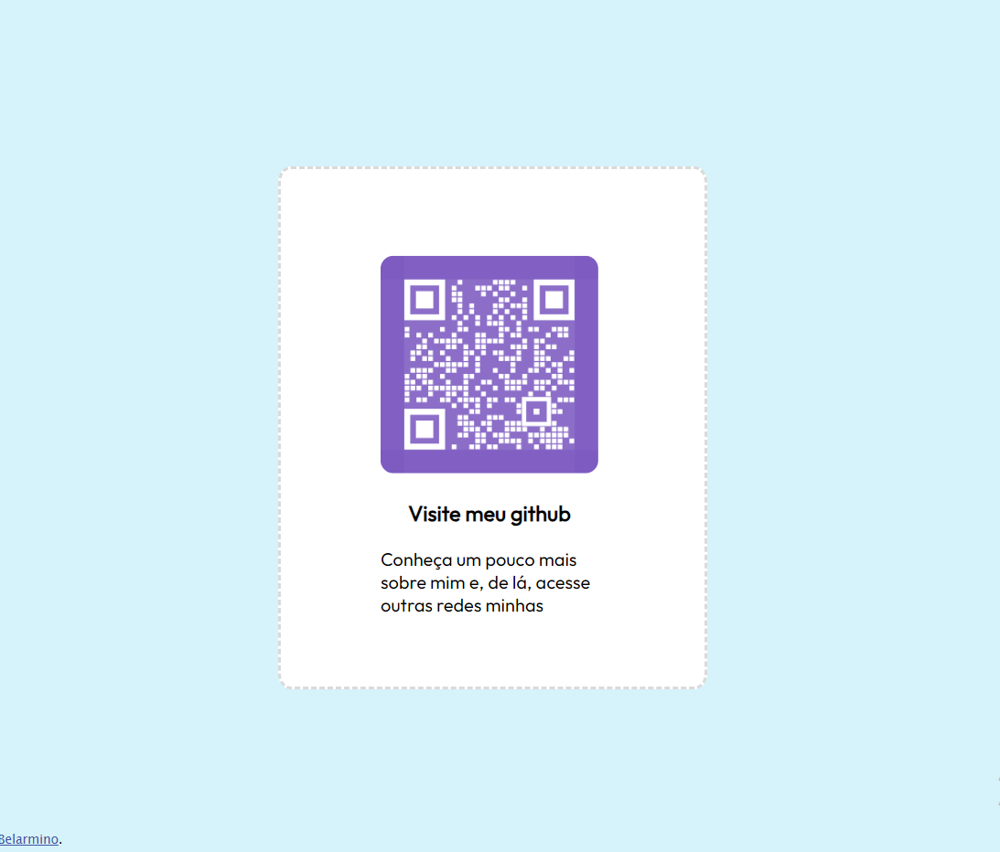

Esse projeto é uma solução para [QR code component challenge on Frontend Mentor](https://www.frontendmentor.io/challenges/qr-code-component-iux_sIO_H).

Autor:
Rafael Henrique Belarmino
-Github: (https://github.com/rafa-henr)

Resultado:

Link para solução na web:
(http://rafa-henr.github.io/componente_qr)